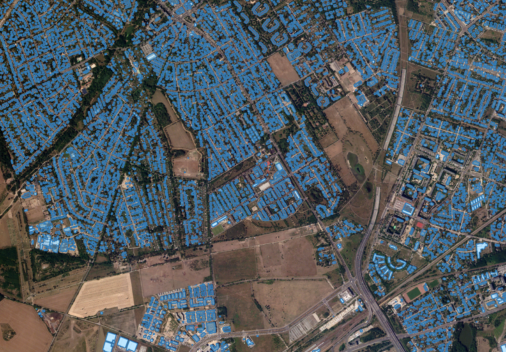

# Building-segmentation-iquaflow-use-case

In this use case we study the model performance of a building segmentation task using different satellite imagery data
products: one processed on the ground and the other processed on board the satellite.

This use case was presented at the 8th International Workshop on On-board Payload Data Compression  https://atpi.eventsair.com/obpdc2022/.



_____________________________________________________________________________________

## How to execute

Use docker and nvidia-docker as follows:

1. Build the docker image

Check the variables in the Makefile, then

```bash
make build
```

1. Raise a running container

```bash
make container
```

3. As soon as the docker is running in background you can launch the following services whithin it:

    * Launch a jupyter lab server

        ```bash
        make nb
        ```

        Then access it from your browser by using this address `localhost:8088/?token=commodities`

    * Stops the jupyter server

        ```bash
        make nbstop
        ```

    * Launch an mlflow server

        ```bash
        make mlf
        ```
        Then access it from your browser by using this address `localhost:5055`

    * To raise an interactive shell from our running container

        ```bash
        make execsh
        ```
        
    * To run tests

        ```bash
        make test
        ```

    * Stop the docker container and everything that is running within it

        ```bash
        make stop
        ```
4. Run the experiment

Inside the docker run 
 ```bash
    python iqf-usecase.py
```
use the `-h` option to see the possible options for this script.